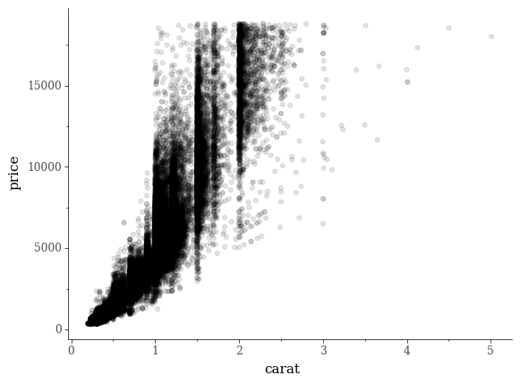

# plotnine_theme_tufte
A port of `theme_tufte` from the `ggthemes` library to `plotnine`.

## Background

I'm a _huge_ fan of the [`plotnine`](https://github.com/has2k1/plotnine)
project and the tremendous effort by [Hassan
Kibirige](https://github.com/has2k1) to bring grammar of graphics to the Python
universe. 

This project is a very simple fork of the `theme_tufte` ggplot2 theme that is
part of the [`ggthemes`](https://github.com/jrnold/ggthemes) library, made
entirely possible by the synctactic parity between `plotnine` and `ggplot2`.

## Usage

Use `theme_tufte` just as you would any other `plotnine` theme:

```python
from plotnine import *
from plotnine import data
from theme_tufte import theme_tufte

df = data.diamonds
p = ggplot(aes(x='carat', y='price'), df)
p + geom_point(alpha=0.1) + theme_tufte()  # Easy as this
```

Output:  



## Future Work

`theme_tufte` is designed to work with a number of custom `geom`s from
`ggthemes`. I'm not familiar enough with the internals of `plotnine` to attempt
porting the various boxplot geoms at this point in time, but it's something I'd
love to try in the future when I have a spare moment or two on my hands. For
now, I'll settle for just the theme.
